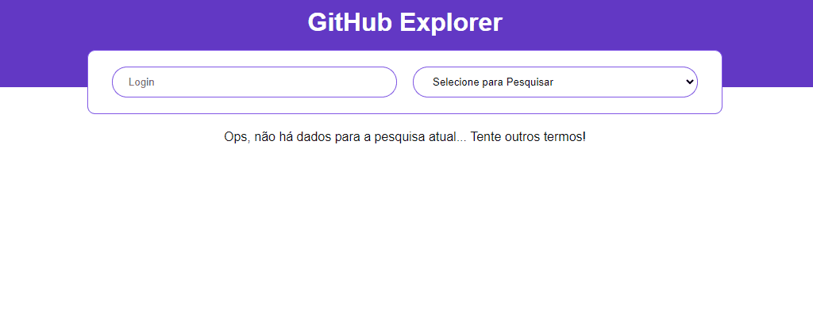

<h1 align="center">
  
</h1>

<h1 align="center">
  
</h1>

<br>

## 📋 Sobre

Aplicação que se conecta com a API pública do GitHub e possibilita a listagem de repositórios tanto de usuários comuns quanto de organizações.

---
<br>

## 🎯 Objetivo
Entender as configurações de ambiente de projetos web utilizando **Babel**, **Webpack**, **Typescript** e **Sass**, além de praticar os conceitos básicos do **ReactJS**, como a utilização de useState e useEffect. 

---
<br>

## 🚀 Tecnologias utilizadas
- ReactJS
- Typescript
- Babel
- Webpack
- Sass
---
<br>

## 🛠 Como baixar o projeto

```bash

# Clonar o repositório
git clone https://github.com/lucasdsaints/github-explorer.git

# Entrar no diretório
cd github-explorer

# Instalar as dependências
yarn install

# Iniciar o projeto
yarn dev

```

---
<br>

Desenvolvido por mim, Lucas A. Santos 😛!